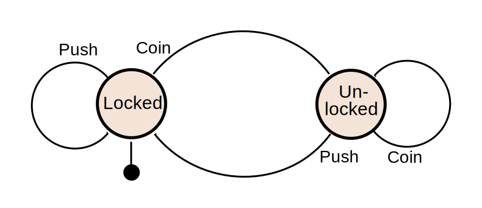
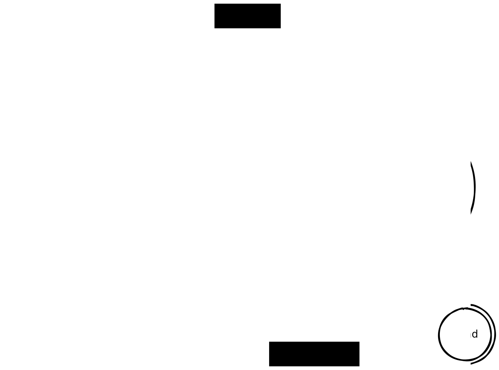
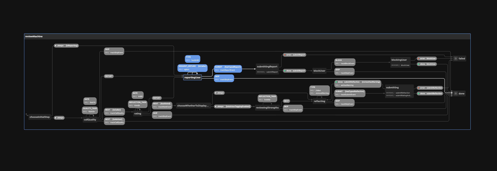
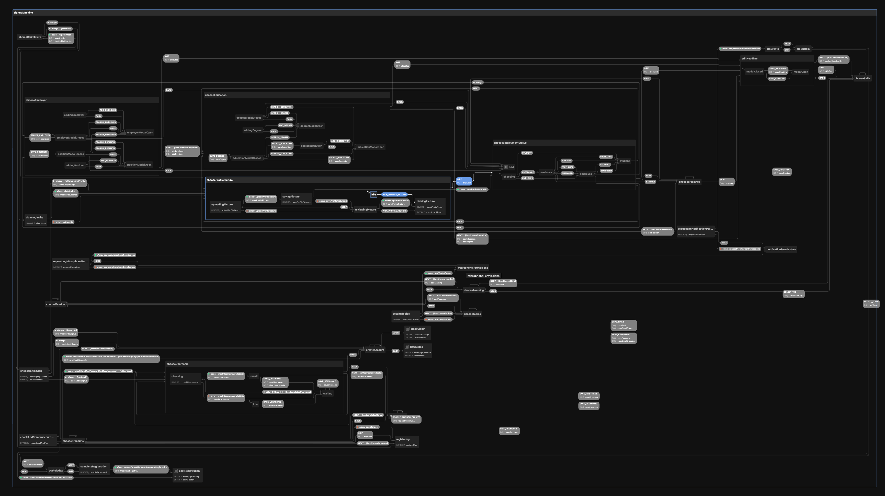

# **[XState] in React Native**

## How I finally managed to keep my views lean and my logic clean

[XState]: http://xstate.js.org/

Dario Villanueva 
`@radiodario`


---

# a bit about me:

* [@radiodario](github.com/radiodario)
* Bulding [Anyone](callinganyone.com) - a Voice Networking App
* ex Meta Reality Labs
* ex CTO at Feeld.co


---

# Unstable of Contents

1. The problem with apps
2. What are Finite State Machines
3. How does XState model FSMs
3. How to use XState in your RN projects
4. Some Pros/Cons with XState


---

# Before we start, a lil' game

---


<!-- Who can tell me what this is -->
---
<style scoped>
h1 {
  text-align: center;
  color: white;
  background: rgba(0,0,0,0.6);
}
</style>
# WRONG!

# This is a photo of what a typical react native project looks like to a new dev who joins your team


---


<!-- Who can tell me what this is -->

---

<style scoped>
h1 {
  text-align: center;
  color: white;
  background: rgba(0,0,0,0.6);
}
</style>

# WRONG!

# This is a photo of a typical redux store after a year of active development by 3 frontend developers.


---


<!-- Who can tell me what this is -->

---
# WRONG!

<style scoped>
h1 {
  text-align: center;
  color: white;
  background: rgba(0,0,0,0.6);
}
</style>

# This is just a photo of a bunch of cats sitting in boxes


---


```!<--- pause for laughter --->```


---

# Face it, we make forms for a living.

---

# And making forms shouldn't be this hard


---

# What do these two have in common?


<!-- 
  They can all be simulated by state machines
-->


---

# Enter (Finite) State Machines

<!--

 ask anyone if they did informatics 101
  - A finite state machine (sometimes called a finite state automaton) is a computation model that can be implemented with hardware or software and can be used to simulate sequential logic and some computer programs. 
  - Finite state machines can be used to model problems in many fields including mathematics, artificial intelligence, games, and linguistics.
  - Finite state automata generate regular languages. 
-->


---


# what is a Finite State Machine?


<!--
 A FSM is a mathematical model of computation. It is an abstract machine that can be in exactly one of a finite number of states at any given time. it can change from one state to another in response to some inputs; the change from one state to another is called a transition.[1] An FSM is defined by a list of its states, its initial state, and the inputs that trigger each transition
--->

---


# he's literally reading out the Wikipedia definition right now smh

<!--
 A FSM is a mathematical model of computation. It is an abstract machine that can be in exactly one of a finite number of states at any given time. it can change from one state to another in response to some inputs; the change from one state to another is called a transition.[1] An FSM is defined by a list of its states, its initial state, and the inputs that trigger each transition
--->

---



<!--

show the states
initial state
the transitions
final state

--->


---


# A litte bit about XState

* JS / TS finite state machines for modern apps
* by [@davidkpiano](https://github.com/davidkpiano) et al.
* very active and lovely community [(discord)](https://discord.gg/xstate)
* https://stately.ai/editor <- visual editor also
* Really good VSCode Plugin
* Automatic typegen for machines


<!--
  - by 
-->
---

# Modelling a my cat with XState


---



<!---
1. First draw your finite state machine. I like excalidraw
2. Think of all the states
3. Think of the conditions
4. etc
--->

---

<!-- _header: 'Modelling My Cat' -->

<iframe style="height: 100%;" src="https://stately.ai/viz/embed/040646b2-22db-4042-bc78-2a62225cc030?mode=viz&panel=code&showOriginalLink=1&readOnly=1&pan=0&zoom=0&controls=1" sandbox="allow-same-origin allow-scripts"></iframe>

---

<!-- _header: 'Modelling My Cat (cont)' -->


<iframe style="height: 100%;" src="https://stately.ai/viz/embed/040646b2-22db-4042-bc78-2a62225cc030?mode=full&panel=code&showOriginalLink=1&readOnly=0&controls=1" sandbox="allow-same-origin allow-scripts"></iframe>

---

# Anatomy of a Cat Machine

```tsx
import { createMachine } from "xstate";

const CatMachine = createMachine(
  {
    initial: "alive",
    context: {
      lives: 9, // the data that change accross "states"
    },
    states: {
     // the states we can be in
    },
  },
  { // these are the options - you don't need to define these here
    actions: {
      // -- named actions here*
    },
    services: {
      // -- services here
    },
    guards: {
      isDead: (ctx) => !ctx.lives,
    },
  }
);

```

--- 

# States, events and transitions

```tsx

states: {
  alive: { 
    always: {
      target: "dead",
      cond: "isDead",
    },
    on: {
      DIE: {
        actions: ["diminishLives"],
      },
    },
  },
  dead: {
    type: "final",
  },
}
```

<!---
always transition will get evaluated everytime we re-enter the state
on defines all the possible transitions from an event
type: 'final' states are states where evaluation ends.
---->
---

# States can be "nested" (child states)

```tsx
alive: {
  initial: "hungry",
  states: {
    hungry: {
      entry: 'meow',
      on: {
        FEED: "disappointed",
      },
    },
    asleep: {
      invoke: {
        src: 'sleep',
        onDone: 'hungry',
      }
    },
    disappointed: {
      on: {
        PET: "hungry",
      },
    },
  },
}
```

---
# Actions for side effects :boom:

``` tsx
actions: {
  meow: () => {
    console.log('meow');
  },
  diminishLives: assign({
    lives: (ctx) => ctx.lives - 1,
  }),
}
```

<!--
Logging something to the console
Assigning a value to a variable
Changing the attribute of a DOM node
--->

---

# Machine Context

aka your _infinite_ "states"

```tsx
context: {
  lives: 9,
  name: 'Tiga',
  awokenAt: new Date(),
},
```

`assign` is an action lets you assign values to the context:

```tsx
actions: {
  diminishLives: assign({
    lives: (ctx, ev) => ctx.lives - 1,
  }),
}
```

<!--
States are used for handling your apps' states which you know about in advance. 
Context is a data store that you can use to store any arbitrary values. 
The assign action can be used to assign values to the context, and the context can be used in any action you call.
--->

---
# Services :loop: (soon to be renamed to Actors)

~~Services~~ Actors model long running processes

```tsx
{
  asleep: {
    invoke: {
      src: 'sleep',
    },
  },
}, {
  services: {
    sleep: async (ctx, ev) => {
      return await DigestiveSystem.digest(ctx.food);
    },
  }
}
```

<!--
- long running
- promises
- observables
- other machines
-->

---

# Invoking ~~services~~ Actors 🧙‍♂️

```tsx
asleep: {
  invoke: {
    id: 'sleep', // an id of your service
    src: 'sleep', // the name of your service in machine opts
    onDone: {
      // what to do when your service finishes
      // aka your promise returns
      target: 'hungry',
    },
    onError: {
      // error handling
      target: 'sick',
    },
  },
},
```

<!--
- long running
- async functions
-->

---

# Guards - for conditional Transitions

```tsx
guards: {
  isDead: (ctx: CatContext) => ctx.lives === 0,
  isHungry: () => true, 
}
```

---

# READ THE DOCS

# 👉 [here](https://stately.ai/docs/xstate) 👈


<!--
I left out a ton of stuff
there's other stuff like actors, hierarchical states
parallel states
--->

---

# Integrating with React Native

<!--

no different than a regular react app
just navigating between screens can be
a bit tricky

--->

---
# Wrap your flow in a context

```tsx
const CatMachineContext = React.createContext<InterpreterFrom<typeof CatMachine>>();

function MyCat = () => {

  const catMachine = useInterpreter(CatMachine, {
    actions: {
      meow: (ctx, ev) => console.log("Meow");
    },
    services: {
      ...
    }
  })

  return (
    <CatMachineContext.Provider value={catMachine}>
      ...
    </CatMachineContext.Provider>
  )
}
```

---

# Add a navigator

```tsx
const CatFlowStack = createNativeStackNavigator<CatFlowParamList>();

function CatFlow = () => {

  const catMachine = useInterpreter(CatMachine, {...});

  return (
     <CatMachineContext.Provider value={catMachine}>
      <CatFlowStack.Navigator>
        <CatFlowStack.Screen name="Hungry" component={HungryScreen} />
        <CatFlowStack.Screen name="Asleep" component={AsleepScreen} />
        <CatFlowStack.Screen name="Disappointed" component={DisappointedScreen} />
        <CatFlowStack.Screen name="Dead" component={DeadScreen} />
      </CatFlowStack.Navigator>
    </CatMachineContext.Provider>
  )
}
```

---

# Grab your cat by the context:

```tsx
const HungryScreen = () => {

  const catService = useContext(CatMachineContext); 

  // subscribe only to what you need
  const livesRemaining = useSelector(catService, 
    current => current.context.lives,
  );

  return (
    <View>
      <Text>{livesRemaining} lives</Text>
      <Image src="@assets/hungry-cat" />
      <Button onPress={() => catService.send('FEED')} />
    </View>
  )
};
```

<!--
 the send function sends events to the machine
--->

---

# Use a hook to navigate by subscribing to state

```tsx
const useHandleNavigation = () => {
  const catService = useContext(CatMachineContext)
  const navigation = useNavigation();

  useEffect(() => {    
    const subscription = catService.subscribe((state) => {
      if (state.matches("alive.asleep")) {
        navigation.navigate('Asleep');
      }
      if (state.matches("alive.disappointed")) {
        navigation.navigate('Disappointed');
      }
      // ... etc
    });
    return subscription.unsubscribe;
  }, [catService, navigation]);
}
```

<!-- 
this can be a bit cumbersome but also powerful. 
it's up to you to use this way
--->

--- 

# You get many things for free

```tsx
const catService = useContext(MyStateMachineContext)
const [currentState, send] = useActor(catService)

// `can` will evaluate to true if the current state has any
// valid transitions in the current state for that event

<Button disabled={currentState.can('FEED')} />


// you can show a spinner for long running services
const isAsleep = useSelector(catService, 
  current => current.matches('alive.asleep')
);

return (isAsleep && <Spinner>)
```


---
# Some things to keep in mind

* Fast refresh breaks if you change the state machine definition `;_;`
* Name your actions/services/guards, trust me.
* Keep state / context lean.
* If you listen to the whole machine state on views that are mounted, the views will re-render
* prefer `useSelector` to `useActor` and grab only what you need from your context / state
* nativeStackNavigator -> `freezeOnBlur: true` screenOption


---

`<!-- Intermezzo --->`


---

# Why do XState:

* Separates your logic from your side effects and views
* Keeps views short and clean
* Reusable services / actions - swap out logic for mocks in tests or different applications
* Do Model Based Testing ([it's _mental_](https://www.youtube.com/watch?v=tpNmPKjPSFQ))
* Rearranging flows / moving things around is easy - just modify the transitions
* Complex flows and logic doesn't mean complex views.
* Flipper Plugin `react-native-flipper-xstate`


---

## Why dont I just use `(redux|jotai|zustand|useReducer|immer|$library)` ?

* do whatever floats your boat idgaf


<!--
also point out the fact that
* Guess what you're using FSMs whether you like them or not
--->

---

* You can use `$your_library_here` and interop via side effects (actions!)
* Forces you think of all the states of your app / flow
* State vs Context
* A good UX designer will have made a UI flow on figma that will look a bit like a FSM
* Try it for one flow/feature in your app and see how you do


<!-- 
  you can have between=machine communication, or send things somewhere else via actions
--->
---

## When should I not use a FSM

* When the potential number of states is _infinite_ 
* When there are very few states
---
<!---
_header: 'A real life specimen of Anyone Post-call review machine'
--->



---




---
### References and further reading

- [Finite State Machines (pdf) - David Wright](https://web.archive.org/web/20140327131120/http://www4.ncsu.edu/~drwrigh3/docs/courses/csc216/fsm-notes.pdf)
- [State machines are wonderful tools - Chris Wellons](https://nullprogram.com/blog/2020/12/31/)
- [Rage Against the Finite-State Machines](https://learnyousomeerlang.com/finite-state-machines)
- [Integrating XState with React Native and React Navigation - Simone D'Avico](https://medium.com/welld-tech/integrate-xstate-with-react-native-and-react-navigation-21ead87391da)

---
# Question Time


---

# Thank you

# slides are there 😎👉👉

