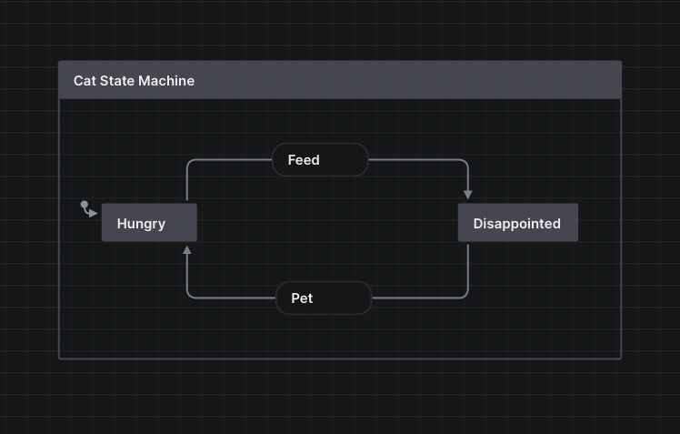

# **[XState] in React Native**

## How I finaly managed to keep my views lean and my logic clean

[XState]: http://xstate.js.org/

---

1. The problem with apps
2. What are state machines
3. How to use them in your projects


---


<!-- Who can tell me what this is -->
---

# WRONG!

This is a photo of a typical react native project


---


<!-- Who can tell me what this is -->

---

# WRONG!

This is a photo of a typical redux store after a year


---


<!-- Who can tell me what this is -->

---

# WRONG!

This just is a photo of a bunch of cats sitting in boxes

---


```!<--- pause for laughter --->```


---

# Face it, you make forms for a living.

---

# And making forms shouldn't be that hard


---

# Enter (Finite) State Machines

<!--
  - A finite state machine (sometimes called a finite state automaton) is a computation model that can be implemented with hardware or software and can be used to simulate sequential logic and some computer programs. 
  - Finite state machines can be used to model problems in many fields including mathematics, artificial intelligence, games, and linguistics.
  - Finite state automata generate regular languages. 
-->

---

# What do these two have in common?


<!-- 
  They can all be simulated by state machines
-->


---

<!-- _header: 'Modelling My Cat' -->



---

<iframe src="https://stately.ai/viz/040646b2-22db-4042-bc78-2a62225cc030"></iframe>

---

# Define your machine

```tsx
import { assign, createMachine } from "xstate";

const machine = createMachine(
  {
    id: "A Typical Cat",
    initial: "alive",
    context: {
      lives: 9,
    },
    states: {
      alive: {
        always: {
          target: "dead",
          cond: "isDead",
        },
        initial: "hungry",
        states: {
          hungry: {
            on: {
              FEED: "disappointed",
            },
          },
          disappointed: {
            on: {
              PET: "hungry",
            },
          },
        },
        on: {
          DIE: {
            actions: ["diminishLives"],
          },
        },
      },
      dead: {
        type: "final",
      },
    },
  },
  {
    actions: {
      diminishLives: assign({
        lives: (ctx) => ctx.lives - 1,
      }),
    },
    services: {},
    guards: {
      isDead: (ctx) => !ctx.lives,
    },
  }
);

```

--- 

# Wrap your flow in a context
```tsx
const MyMachineContext = React.createContext<InterpreterFrom<typeof MyMachine>>();

function MyFlow = () => {

  const machine = useInterpreter(myMachineDefinition, {
    actions: {
      ...
    },
    services: {
      ...
    }
  })

  return (
    <MyMachineContext.Provider value={machine}>
      ...
    </MyMachineContext.Provider>
  )
}

```

---

# Add a navigator

```tsx

const MyFlowStack = createNativeStackNavigator<MyFlowParamList>();

function MyFlow = () => {

  const machine = useInterpreter(myMachineDefinition, { ... })

  return (
    <MyMachineContext.Provider value={machine}>
      <MyFlowStack.Navigator>
        <MyFlowStack.Screen name="login" component={LoginScreen} />
        <MyFlowStack.Screen name="authorizationError" component={AuthorizationErrorScreen} />
      </MyFlowStack.Navigator>
    </MyMachineContext.Provider>
  )
}

```

---

something else

---
---

# Use a hook to navigate

```ts
const useHandleNavigation = () => {
  const service = useContext(MyStateMachineContext)
  const navigation = useNavigation<NativeStackNavigationProp<();

  useEffect(() => {    
    const subscription = service.subscribe((state) => {
      if (state.matches("authorizationExpired")) {
        navigation.navigate(
          "AuthorizationError", { 
            message: "Cannot authorise payments on this device.",
        });
      }
    }
    return subscription.unsubscribe;
  }, [service, navigation]);
}
```

--- 

# You get many things for free

```tsx

const service = useContext(MyStateMachineContext)
const service = useActor()


```

---

### Some things to keep in mind

* Autorefresh doesn't work
* Keep state / context lean

---

### References and further reading

* [State machines are wonderful tools - Chris Wellons](https://nullprogram.com/blog/2020/12/31/)
* [Rage Against the Finite-State Machines](https://learnyousomeerlang.com/finite-state-machines)
* [Integrating XState with React Native and React Navigation - Simone D'Avico](https://medium.com/welld-tech/integrate-xstate-with-react-native-and-react-navigation-21ead87391da)